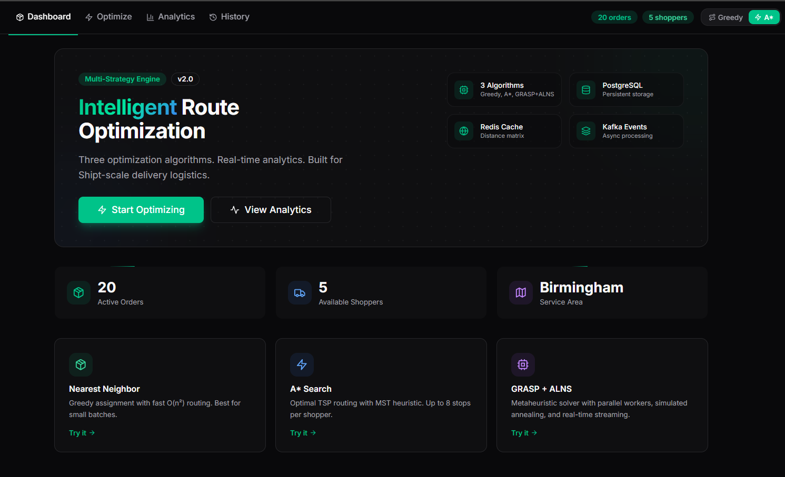
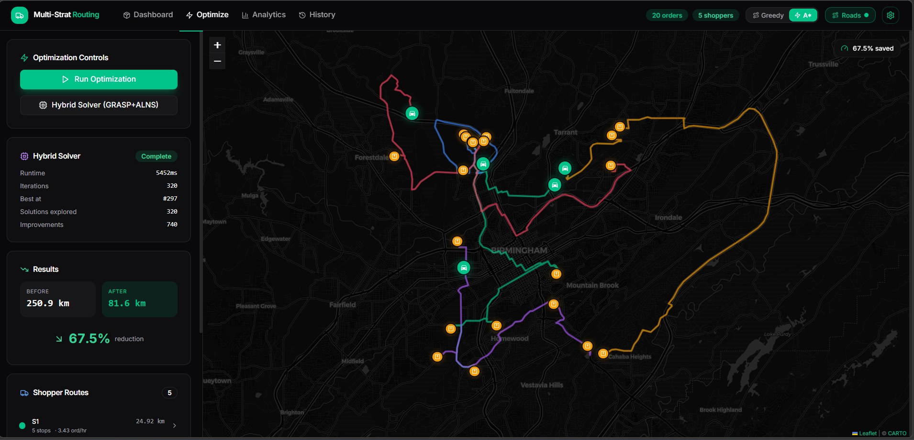

<div align="center">

# Multi-Strategy Routing Engine

**A production-grade delivery route optimization platform built with Go, PostgreSQL, and React.**

Three optimization algorithms. Event-driven architecture. Real-time analytics.
Containerized with Docker and orchestrated with Kubernetes.

[](https://go.dev)
[](https://postgresql.org)
[](https://react.dev)
[](https://docker.com)
[](https://kubernetes.io)

</div>

---





---

## What This Does

The engine takes a set of delivery orders and available shoppers, then finds the optimal assignment and routing using one of three algorithms — minimizing total travel distance while respecting capacity constraints. Results are persisted to PostgreSQL.

---

## Architecture

```
┌─────────────────────────────────────────────────────────────────┐
│                         Frontend (React)                        │
│              Vite · Tailwind · Leaflet · Recharts               │
└───────────────────────────┬─────────────────────────────────────┘
                            │ HTTP / NDJSON Stream
┌───────────────────────────▼─────────────────────────────────────┐
│                        API Service (Go/Gin)                     │
│                                                                 │
│  ┌──────────┐  ┌──────────┐  │
│  │  REST API │  │  CRUD    │  │
│  │  Handlers │  │  Repos   │  │
│  └──────────┘  └────┬─────┘  │
└──────────────────────┼────────┘
                       │
              ┌────────▼──┐
              │ PostgreSQL │
              │   (Data)   │
              └────────────┘
```

---

## Tech Stack

| Layer | Technology | Purpose |
|---|---|---|
| **Language** | Go 1.21+ | Backend API service |
| **HTTP** | Gin | REST API framework with middleware |
| **SQL Database** | PostgreSQL 16 | Orders, shoppers, optimization history |
| **Frontend** | React 18 + Vite | Dark-themed dashboard with shadcn-style components |
| **Maps** | Leaflet.js | Interactive route visualization on dark CARTO tiles |
| **Charts** | Recharts | Analytics charts (bar, area, pie) |
| **Animations** | Framer Motion | Aceternity-style spotlight cards, moving borders |
| **Containers** | Docker + Compose | Multi-service orchestration (7 containers) |
| **Orchestration** | Kubernetes | Production deployment manifests |
| **CI/CD** | GitHub Actions | Lint, test, build, Docker image push |
| **Migrations** | golang-migrate | Versioned SQL schema migrations |
| **Testing** | testify | Table-driven unit tests and HTTP handler tests |

---

## Algorithms

### 1. Nearest Neighbor (Greedy)

Assigns each order to the closest available shopper, then sequences stops using a greedy nearest-neighbor heuristic. Fast O(n²), good baseline.

### 2. A* Search

Solves the per-shopper TSP using A* with a minimum spanning tree (MST) lower-bound heuristic. Exact for up to 8 stops, beam search beyond. Typically 10-20% better than greedy.

### 3. GRASP + ALNS (Hybrid Metaheuristic)

Constructs initial solutions via GRASP with randomized candidate lists, then iteratively destroys and repairs them using Adaptive Large Neighborhood Search with simulated annealing acceptance. Runs across parallel goroutine workers with real-time NDJSON progress streaming.

---

## Quick Start

### Option A: Docker Compose (recommended)

One command to run the entire stack — API, frontend, Postgres:

```bash
docker-compose up --build
```

Then open **http://localhost** in your browser.

### Option B: Local Development

**Prerequisites:** Go 1.21+, Node.js 18+

```bash
# Terminal 1 — Backend
cd backend
cp .env.example .env
go mod download
go run cmd/main.go

# Terminal 2 — Frontend
cd frontend
npm install
npm run dev
```

Backend runs on `:8080`, frontend on `:5173`.

---

## API Reference

| Method | Endpoint | Description |
|---|---|---|
| `GET` | `/api/health` | Health check (Postgres status) |
| `GET` | `/api/sample-data` | Load 5 shoppers + 20 orders (Birmingham, AL) |
| `POST` | `/api/optimize` | Basic nearest-neighbor optimization |
| `POST` | `/api/optimize-analytics` | Optimization + full analytics + route geometries |
| `POST` | `/api/optimize-hybrid-stream` | GRASP+ALNS solver with NDJSON progress stream |
| `GET/POST` | `/api/orders` | List / create orders (PostgreSQL) |
| `GET/POST` | `/api/shoppers` | List / create shoppers (PostgreSQL) |
| `GET` | `/api/optimizations` | Optimization run history |
| `GET` | `/api/optimizations/:id` | Single run with assignments |

---

## Project Structure

```
├── backend/
│   ├── cmd/
│   │   ├── main.go                    # API server entry point
│   ├── internal/
│   │   ├── api/                       # HTTP handlers (REST + streaming)
│   │   ├── database/                  # PostgreSQL pool, migrations
│   │   │   └── migrations/            # SQL migration files
│   │   ├── models/                    # Domain types
│   │   ├── optimizer/                 # Greedy, A*, hybrid algorithms
│   │   │   └── hybrid/               # GRASP + ALNS solver
│   │   ├── repository/               # PostgreSQL CRUD repositories
│   │   └── routing/                   # OpenRouteService client
│   ├── Dockerfile                     # Multi-stage Go build
│   ├── Makefile
│   └── go.mod
│
├── frontend/
│   ├── src/
│   │   ├── components/
│   │   │   ├── ui/                    # shadcn-style primitives
│   │   │   ├── views/                 # Dashboard, Optimize, Analytics, History
│   │   │   └── MapView.jsx            # Leaflet dark map
│   │   ├── lib/utils.js               # cn(), formatters
│   │   ├── api/optimizer.js           # API client
│   │   └── App.jsx
│   ├── Dockerfile                     # Node build + nginx
│   └── package.json
│
├── k8s/                               # Kubernetes manifests
│   ├── namespace.yaml
│   ├── api-deployment.yaml            # 2-replica API with health probes
│   ├── postgres-statefulset.yaml      # PVC-backed database
│   ├── configmap.yaml
│   ├── secrets.yaml
│   └── ingress.yaml
│
├── .github/workflows/ci.yml          # CI/CD pipeline
├── docker-compose.yml                 # Full stack orchestration
└── .env.example
```

---

## Database Schema

Four tables with foreign key relationships, managed via golang-migrate:

```sql
shoppers        orders              optimization_runs     assignments
─────────       ──────              ─────────────────     ───────────
id (UUID PK)    id (UUID PK)        id (UUID PK)          id (UUID PK)
name            lat, lng            algorithm             run_id (FK)
lat, lng        item_count          total_orders          shopper_id
capacity        delivery_window     total_shoppers        order_id
status          status              distance_before       sequence_num
created_at      created_at          distance_after        distance
updated_at      updated_at          improvement_pct
                                    duration_ms
                                    created_at
```

---

## Testing

24 tests across two packages, all passing:

```bash
cd backend
go test ./... -v

# Optimizer tests (17): Haversine, empty inputs, nearest-shopper,
#   capacity, A* optimality, route improvement
# Handler tests (7): health check, sample data, optimize endpoints,
#   invalid input handling
```

---

## CI/CD Pipeline

GitHub Actions runs on push to `main` and on pull requests:

1. **Lint** — `golangci-lint` static analysis
2. **Test** — `go test -race` with Postgres + Redis service containers
3. **Build** — Compile API binary
4. **Docker** — Build and push images to GitHub Container Registry

---

## Kubernetes Deployment

```bash
kubectl apply -f k8s/namespace.yaml
kubectl apply -f k8s/

# Verify
kubectl get pods -n shipt-routing
```

The API deployment runs 2 replicas with HTTP readiness and liveness probes on `/api/health`.

---

## Environment Variables

| Variable | Description | Default |
|---|---|---|
| `DATABASE_URL` | PostgreSQL connection string | — |
| `OPENROUTE_API_KEY` | OpenRouteService API key (optional, for real road routing) | — |
| `PORT` | API server port | `8080` |

All services degrade gracefully — the API runs without Postgres, falling back to in-memory operation.

---

## License

MIT

